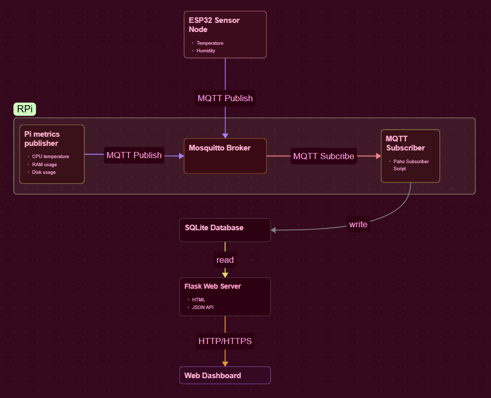

# MQTT IoT Platform

## Overview

This project is a modular MQTT-based IoT platform centred around a Raspberry Pi. It provides the infrastructure required to receive telemetry from embedded devices, persist it locally, and expose it for visualisation and further processing.

The included ESP32 + DHT11 firmware serves as a reference implementation. Any device capable of publishing JSON messages over MQTT can be integrated with minimal changes.

## Architecture



## Project Purpose

Although the current implementation demonstrates environmental monitoring using a DHT11 sensor, the project was designed as a reusable IoT platform. Any device capable of publishing JSON over MQTT can be integrated without modifying the backend.

## Features

* MQTT broker hosted on Raspberry Pi (Mosquitto)
* Automatic service installation via `setup.sh`
* ESP32 reference firmware using ArduinoJson
* Automatic ingestion of MQTT messages
* SQLite storage
* Flask web dashboard and JSON API
* Python-based backend
* Automatic deployment via setup.sh and systemd
* Extensible architecture for additional sensors and actuators

## Tech Stack

- **Embedded:** ESP32, Arduino
- **Messaging:** MQTT (Mosquitto)
- **Backend:** Python, Paho MQTT, Flask
- **Database:** SQLite
- **Frontend:** HTML, JavaScript, Chart.js

## Hardware

Current reference hardware:

* Raspberry Pi
* ESP32 development board
* DHT11 temperature & humidity sensor

The platform is not limited to these devices.

## Installation

Clone the repository on the Raspberry Pi (or any other linux computer) and run:

```bash
chmod +x setup.sh
./setup.sh
```

The installation script automatically:

* installs system packages
* creates a Python virtual environment
* installs Python dependencies
* initializes the SQLite database
* creates and enables the required systemd services
* starts Mosquitto and all project services

No manual configuration on the Raspberry Pi is required beyond editing configuration files (for example MQTT server addresses or Wi-Fi credentials where appropriate).

On the ESP32 (if using given code), add a file named `secrets.h` using the `secrets_template.h` provided as a reference, to store wifi ssid, password and the pi's IP address. Using `<piUsername>.local` is suggested instead of actual ip address. 

## Running

After installation, the platform starts automatically at boot.

Service status can be checked with:

```bash
systemctl status envmonitor-subscriber
systemctl status envmonitor-pi-publisher
systemctl status envmonitor-web
```

To restart a service:

```bash
sudo systemctl restart envmonitor-subscriber
```

---

## MQTT Topics

Current convention:

```text
sensors/<device_id>
```

Examples:

```text
sensors/esp32_1
sensors/pi
```

Payloads are JSON objects containing one or more sensor values.

Example:

```json
{
    "temperature": 24.8,
    "humidity": 43
}
```

## Adding a New Device

Adding another device typically requires only:

1. Configure the device to connect to the MQTT broker.
2. Publish JSON to a unique topic:

```
sensors/<device_id>
```

No changes to the subscriber are required. New metrics are automatically stored in SQLite.

## Uninstallation

To remove the project services from the system:

```bash
chmod +x uninstall.sh
./uninstall.sh
```

This stops and disables the systemd services, removes their service files, and reloads the systemd daemon.

The script does **not** remove the project directory, the Python virtual environment, the SQLite database or the system packages

These can be removed manually if no longer required.